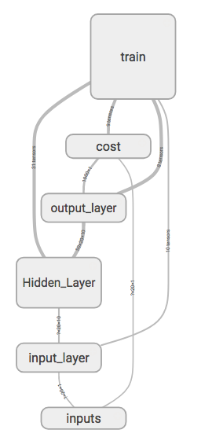

 # Title : Long Short Term Memory Recurrent Neural Network Regression  By Daniel


## Content:  Generating a Sine curve(blue & dash line) which will predict another Cos curve(red line)


> Are you exciting now?  Follow me, step by step  !!! Just training with CPU. Don't worry about the dame high price of GPU !!!

## Model Graph



 

---

> Anaconda is a distribution of packages built for data science. It comes with conda, a package and environment manager. You'll be using conda to create environments for isolating your projects that use different versions of Python and/or different packages. You'll also use it to install, uninstall, and update packages in your environments. Using Anaconda has made my life working with data much more pleasant.  --- Udacity

> Anaconda is available for Windows, Mac OS X, and Linux. You can find the installers and installation instructions at https://www.continuum.io/downloads.

> Once, you have installed Anacoda in your OS. You can follow me by following steps:

- Step 1. To create an environment. Open your Teminal, then input the following command line.

```
> conda env create -f environment.yaml
```

- Step 2. Entering an environment.

```
> source activate tensorflow
```
